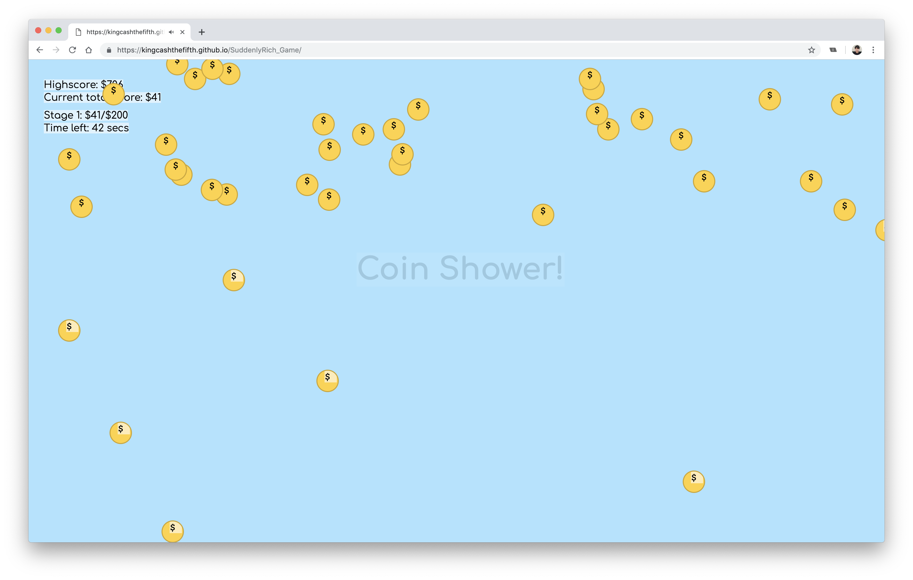

# Suddenly Rich

Game link: https://kingcashthefifth.github.io/SuddenlyRich_Game/

_A game where money falls from the sky, you know what to do next_ ;)

Have you ever thought of having money dropping from the sky AND catching it? Have you ever dreamt of being suddenly rich?

So have I.

Introducing...

"Suddenly Rich." Developed by Cash :)

## Instructions
Once you click start, just move your mouse or trackpad to catch the objects.
Simple, that's it! Enjoy! :D

## Features
- Anti-cheat mechanics (Move constantly to collect coins, if basket is idle on screen, coins passes through basket)
- Sound effects
- Never ending game, it gets more and more difficult as you progress through the stages
- Challenge yourself to beat your own highscore!
- You will gain happiness
- Your mental health will improve (relieves stress)

## Skills used to complete this project

Javascript
- DOM manipulation
- Loops
- Functions
- setTimeout & setIntervals
- Event Listeners
- clientX & clientY

HTML
- Boilerplate and tags structuring
- Audio tags

CSS (Besides the usual basic properties)
- z-index
- Animations
- Keyframes
- ::before & :: after
